<div align="center">

# Wreath

**A complete Python web stack, compiled around the application you declare.**

[](https://www.python.org/downloads/)
[](https://asgi.readthedocs.io/)


[](https://github.com/alexogeny/wreath/blob/main/LICENSE)

Framework, PostgreSQL stack, identity, policy, durable work, observability and a
native HTTP server in one Python 3.14-first package. The core has no mandatory
runtime dependencies and remains an ordinary ASGI application.

[Documentation](https://alexogeny.github.io/wreath/) ·
[Build a serious API](https://alexogeny.github.io/wreath/stories/serious-api.html) ·
[Runnable example](example/README.md) ·
[Issues](https://github.com/alexogeny/wreath/issues)

</div>

<p align="center">
  
</p>

## Declare the application once

The route below gets compiled binding, bounded fields, native JSON, replay-safe
writes, request IDs, security headers and an OpenAPI operation from the same
declarations.

```python title=app.py
from dataclasses import dataclass
from typing import Annotated

from wreath import Request, Wreath
from wreath.binding import Body, Field
from wreath.policy import HttpPolicy, IdempotencyPolicy
from wreath.policy.request_id import RequestIdPolicy
from wreath.policy.security import SecurityHeadersPolicy


@dataclass
class RunRequest:
    prompt: Annotated[str, Field(min_length=3, max_length=2_000)]
    model: Annotated[str, Field(min_length=2, max_length=80)]


app = Wreath(
    http_policy=HttpPolicy(
        idempotency=IdempotencyPolicy(),
        request_id=RequestIdPolicy(),
        security_headers=SecurityHeadersPolicy(),
    )
)


@app.post("/runs")
async def create_run(
    request: Request,
    command: Annotated[RunRequest, Body()],
) -> dict:
    return {"state": "queued", "model": command.model, "prompt": command.prompt}


app.enable_api_docs(environments=("development",), try_it_out=True)
```

```bash
uv add wreath
uv run wreath dev app:app
```

`uvicorn app:app` is valid too. Choose Wreath's native server when you
want its full HTTP, TLS, telemetry and flight-recording path.

## One lifecycle, fewer seams

### HTTP and policy

Routing, binding, middleware, security, CORS, CSRF, sessions, caching,
idempotency, rate limits, OpenAPI and response delivery share one compiled
application image. Wreath also makes modern HTTP useful at the declaration:
[QUERY](https://www.rfc-editor.org/rfc/rfc10008.html),
[API Catalog](https://www.rfc-editor.org/rfc/rfc9727.html),
[Link-Template](https://www.rfc-editor.org/rfc/rfc9652.html),
[Content-Digest](https://www.rfc-editor.org/rfc/rfc9530.html),
[Cache-Status](https://www.rfc-editor.org/rfc/rfc9211.html),
[Cache-Groups](https://www.rfc-editor.org/rfc/rfc9875.html),
[Deprecation](https://www.rfc-editor.org/rfc/rfc9745.html),
[Sunset](https://www.rfc-editor.org/rfc/rfc8594.html) and
[incremental delivery](https://www.rfc-editor.org/rfc/rfc10036.html).

### Data and durable work

The owned PostgreSQL driver, migrations, declarative models, prepared queries,
transactions, lease/fence primitives, jobs, schedules, event delivery and
outbox patterns use the same startup and shutdown boundary. The
[data guide](https://alexogeny.github.io/wreath/guides/data.html) starts small;
the [migration workflow](https://alexogeny.github.io/wreath/guides/migration-workflow.html)
covers production changes.

### Billing and subscriptions

Hosted checkout, subscriptions, portals, refunds, Stripe Connect and Managed
Payments share one provider-neutral control plane. Wreath maps application plans
to provider prices, projects verified webhooks into its owned ledger, derives
atomic Cedar entitlements, and reconciles remote state without holding a database
transaction across network I/O. Direct card capture is deliberately outside the
API; deployment-owned compliance decisions remain visible instead of becoming a
framework promise. See [billing and subscriptions](https://alexogeny.github.io/wreath/reference/billing.html).

### ChatOps

One typed command declaration can serve Slack, Microsoft Teams and Discord with
no provider SDK dependency. Wreath owns ingress verification, manifests,
acknowledgements and bounded delivery, then reuses the application's identity,
organization, Cedar, rate-limit, durable-job, stream, notification and agent
infrastructure. Existing Entra or Google-backed users can resolve through the
same application identity and permission stores; profile fields never silently
provision or merge accounts. See the [ChatOps runtime](https://alexogeny.github.io/wreath/reference/chat.html).

### Identity and operations

Bearer and cookie identity, OAuth BFF sessions, step-up authentication, SAML,
SCIM, Cedar authorization, tenant boundaries, privacy work, audit evidence,
metrics and forensic capture are first-class surfaces. Unsupported combinations
fail when the application compiles, before they become production slow paths.

## Build the part that is hard

The guides are backed by complete systems, not disconnected snippets:

- [secure product API](https://alexogeny.github.io/wreath/stories/serious-api.html),
  [live energy depot](https://alexogeny.github.io/wreath/stories/energy-depot.html),
  and [personal device fleet](https://alexogeny.github.io/wreath/stories/agent-fleet.html)
- [automation backplane](https://alexogeny.github.io/wreath/stories/automation-backplane.html),
  [governed MCP control room](https://alexogeny.github.io/wreath/stories/mcp-control-room.html),
  and [enterprise control plane](https://alexogeny.github.io/wreath/stories/enterprise.html)
- [time-series laboratory](https://alexogeny.github.io/wreath/stories/time-series-lab.html),
  [noon-drop storefront](https://alexogeny.github.io/wreath/stories/noon-drop.html),
  and [offline operations service](https://alexogeny.github.io/wreath/stories/field-operations.html)

The conventional paths remain close at hand: [HTTP and OpenAPI](https://alexogeny.github.io/wreath/guides/http-api.html),
[browser applications](https://alexogeny.github.io/wreath/guides/browser-apps.html),
[CLI tasks](https://alexogeny.github.io/wreath/guides/cli.html), and the
[production runbook](https://alexogeny.github.io/wreath/guides/deployment.html).

## Performance you can audit

Wreath skips request-time work by compiling stable facts at startup, crosses the
Python/native boundary in batches, and moves byte-heavy work into owned native
kernels. It does not treat “rewritten in C” as evidence.

<p align="center">
  
</p>

Both charts come from the retained
[raw samples](benchmarks/baselines/e2e-holistic-stack-instructions.json). The
request includes TLS 1.3, policy and sessions, nested typed input, bearer and
Cedar authorization, PostgreSQL and HTTP wire calls, temporal, geospatial and
vector work, ranked pagination, protobuf, MessagePack, templates and
compression. Every response is verified before a sample is accepted.

Instructions use five alternating 30/15-request slopes and an unchanged A/A
control. Memory uses five separate fresh-process runs, summing the server and all
descendants from `/proc/<pid>/smaps_rollup`; PSS apportions shared mappings while
RSS counts each mapping in every process. The 2 ms process-tree scan can miss a
shorter-lived peak. These are instruction and memory accounts, not elapsed-time
or throughput claims.

The motion is authored with Anime.js and sampled into standalone SVG animation;
the complete final frame is the fallback when a host does not animate SVG. The
dependency exists only in [`tools/readme_charts`](tools/readme_charts/README.md),
never in Wreath or its wheel. The
[benchmark guide](benchmarks/README.md) carries the commands, equivalent-work
checks, framework-specific limitations, cache counters and native gzip corpus.

## Install

```bash
pip install wreath
# or
uv add wreath

uv add 'wreath[linux]'  # io_uring reactor and native TLS on Linux
uv add 'wreath[h3]'     # HTTP/3; `http3` is an alias
```

The base wheel includes Wreath's portable C implementation. Use the framework on
any conforming ASGI server, or select the accelerated server components
explicitly.

Wreath is pre-1.0. The
[version, platform and upgrade contract](https://alexogeny.github.io/wreath/start/releases.html)
states what each release supports.

## Engineering contract

Performance changes keep repeated equivalent measurements and raw evidence.
Wire behavior is checked against independent implementations or standards.
Unsupported declarations refuse at startup. Native code owns no process-global
mutable state. Hot-path complexity and Python/native crossings have executable
baselines, and behavior changes ship with focused tests.

```bash
uv sync
uv run wreath-check
uv run wreath test
```

The repository's [`AGENTS.md`](AGENTS.md) is the complete engineering contract.
